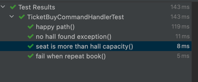

this a simple code for hall booking seat and selling ticket.

how to start
```
mvn clean test

[INFO] 
[INFO] -------------------------------------------------------
[INFO]  T E S T S
[INFO] -------------------------------------------------------
[INFO] Running com.shawn.film.application.TicketBuyCommandHandlerTest
[INFO] Tests run: 4, Failures: 0, Errors: 0, Skipped: 0, Time elapsed: 0.128 s - in com.shawn.film.application.TicketBuyCommandHandlerTest
[INFO] 
[INFO] Results:
[INFO] 
[INFO] Tests run: 4, Failures: 0, Errors: 0, Skipped: 0
[INFO] 
[INFO] ------------------------------------------------------------------------
[INFO] BUILD SUCCESS
[INFO] ------------------------------------------------------------------------
[INFO] Total time:  22.879 s
[INFO] Finished at: 2023-06-08T09:53:40+08:00
[INFO] ------------------------------------------------------------------------
```

the ut result


